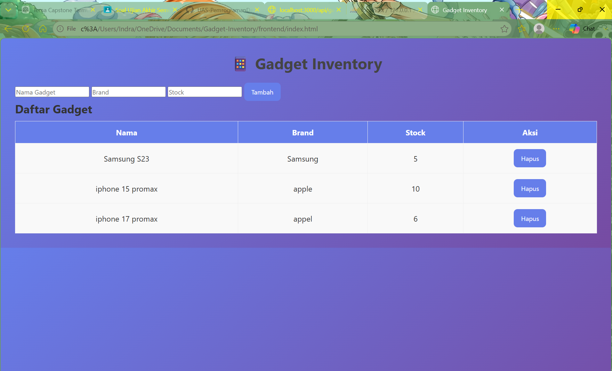
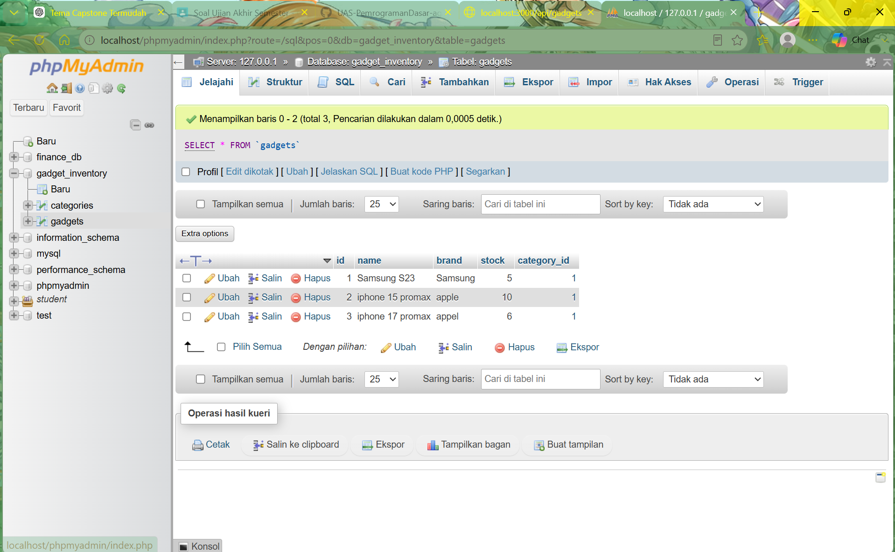

# 📱 Gadget Inventory System

## 👨‍💻 Identitas Mahasiswa
- **Nama**: Agus Indra Wijaya
- **NIM**: 2025806066 
- **Kelas**: Teknologi Informasi 2
- **Tema Proyek**: Gadget Inventory 

---

## 📌 Deskripsi Aplikasi
Aplikasi ini merupakan sistem manajemen inventaris gadget berbasis web yang digunakan untuk mengelola data perangkat seperti smartphone dan laptop.  
Pengguna dapat melakukan operasi CRUD (Create, Read, Update, Delete) melalui REST API dan tampilan web sederhana.

---

## 🚀 Teknologi yang Digunakan
- HTML5
- CSS3
- JavaScript (Fetch API)
- Node.js
- Express.js
- MySQL
- REST API

---

## 🧱 Struktur Project
gadget-inventory/
│
├── backend/
│ ├── app.js
│ ├── package.json
│ ├── .env
│ ├── config/db.js
│ ├── routes/gadgetRoutes.js
│ ├── controllers/gadgetController.js
│ └── models/gadgetModel.js
│
├── frontend/
│ ├── index.html
│ ├── css/style.css
│ └── js/script.js
│
├── database.sql
├── screenshot.png
└── README.md

---

## ⚙️ Cara Menjalankan Aplikasi

### 1. Clone Repository
 https://github.com/agusindrawijaya1-boop/UAS-PemrogramanDasar-agusindra-2025806066
cd UAS-PemrogramanDasar-agusindra-2025806066

---

### 2. Setup Backend
cd backend
npm install
npm run dev

---

### 3. Setup Database
- Jalankan XAMPP (MySQL ON)
- Buka phpMyAdmin
- Buat database: `gadget_inventory`
- Import file: `database.sql`

---

### 4. Jalankan Frontend
Buka file:
frontend/index.html
di browser

---

## 🌐 Endpoint REST API

| Method | Endpoint | Deskripsi |
|--------|---------|----------|
| GET | /api/gadgets | Ambil semua data gadget |
| GET | /api/gadgets/:id | Ambil data berdasarkan ID |
| POST | /api/gadgets | Tambah data gadget |
| PUT | /api/gadgets/:id | Update data gadget |
| DELETE | /api/gadgets/:id | Hapus data gadget |

---

## 🧪 Contoh Request (POST)

```json
{
  "name": "iPhone 15 Pro Max",
  "brand": "Apple",
  "stock": 5,
  "category_id": 1
}
## 📸 Screenshot Aplikasi


